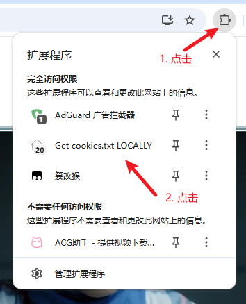
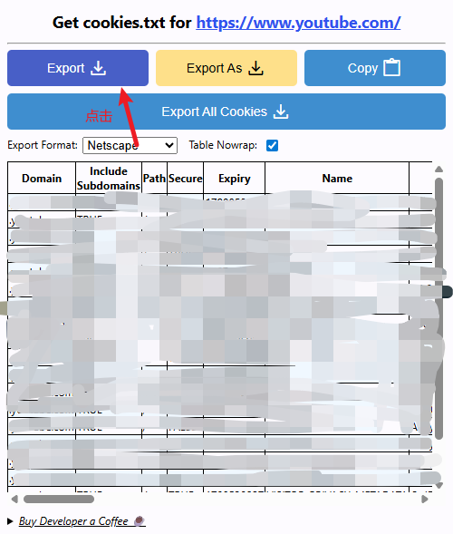

# 获取 YouTube Cookie 文件

本教程介绍如何获取 YouTube Cookie 文件，用于 yt-dlp 访问会员专享或年龄限制视频。

教程来源：[How do I pass cookies to yt-dlp?](https://github.com/yt-dlp/yt-dlp/wiki/FAQ#how-do-i-pass-cookies-to-yt-dlp)

---

## 步骤 1：安装 Chrome 浏览器

下载并安装 Chrome 浏览器：[Chrome 浏览器官网](https://www.google.com/intl/zh-CN/chrome/)

---

## 步骤 2：安装 Get cookies.txt LOCALLY 插件

1. 打开 Chrome 网上应用店
2. 访问插件页面
```bash
https://chrome.google.com/webstore/detail/get-cookiestxt-locally/cclelndahbckbenkjhflpdbgdldlbecc
```
3. 点击"添加至 Chrome"安装插件

---

## 步骤 3：登录 YouTube 账号

1. 在 Chrome 浏览器中打开 YouTube
```bash
https://www.youtube.com
```
2. 登录你的 YouTube/Google 账号

---

## 步骤 4：导出 Cookie 文件

1. **点击浏览器工具栏中的插件图标**

   

2. **点击 "Export" 按钮**

   插件会自动生成 `www.youtube.com_cookies.txt` 文件并下载到默认下载目录

   

---

## 使用 Cookie 文件

导出 Cookie 文件后，可在 yt-dlp 中通过 `--cookies` 参数使用：

```bash
python youtube/downloader.py "https://www.youtube.com/watch?v=xxx" --cookies "C:\path\to\www.youtube.com_cookies.txt"
```

> **注意**：Cookie 文件会过期，建议定期重新导出。
